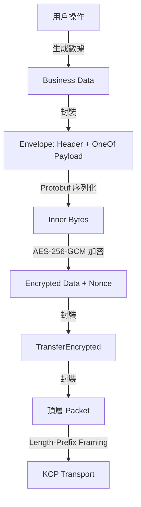

# 《台灣三國誌：萬人版》技術開發設計文件 (Domain-Driven Development Document)

> **上層文件**：[README.md](../README.md)（專案總綱）
> **平行文件**：[GDD.md](./GDD.md)（遊戲設計文件）
> **下層文件**：各 Phase 實作計劃（`docs/phases/`）

---

## 修訂紀錄

| 版本 | 日期       | 變更描述 |
| :--- | :---       | :---     |
| 1.1  | 2026-03-30 | 借鑑 DiceTower 成熟實作，全面更新協定架構為三層封包 (Packet→TransferEncrypted→Envelope)、ECDH+AES-GCM 加密通道、Seq/Ack 應用層可靠性、Session Resume + PendingQueue 遷移、HandleEnvelope(env, send, broadcast) Handler 模式。 |
| 1.0  | 2026-03-30 | 初版建立，定義技術棧、架構、協定與各領域規範。 |

---

## 目錄

1. [技術棧與工具鏈](#一技術棧與工具鏈)
2. [系統架構總覽](#二系統架構總覽)
3. [協定先行 (Protocol-First)](#三協定先行-protocol-first)
4. [伺服器端架構](#四伺服器端架構)
5. [客戶端架構](#五客戶端架構)
6. [網路通訊層](#六網路通訊層)
7. [資料持久化](#七資料持久化)
8. [前端 UI 框架](#八前端-ui-框架)
9. [安全性與反作弊](#九安全性與反作弊)
10. [效能與擴展性](#十效能與擴展性)
11. [開發規範與流程](#十一開發規範與流程)
12. [目錄結構](#十二目錄結構)

---

## 一、技術棧與工具鏈

### 1.1 核心技術

| 層級     | 技術選型         | 版本     | 用途 |
| :---     | :---             | :---     | :--- |
| **語言** | Go               | 1.26.0   | 前後端共用 |
| **渲染** | Ebiten           | 2.x      | 2D 遊戲引擎（客戶端） |
| **網路** | xtaci/kcp-go     | latest   | 基於 UDP 的可靠傳輸 |
| **序列化** | Protocol Buffers | v3     | 訊息協定定義 |
| **建構** | Go Modules       | -        | 依賴管理 |

### 1.2 開發工具

| 工具     | 用途 |
| :---     | :--- |
| `protoc` + `protoc-gen-go` | Protobuf 編譯 |
| `gen_proto.sh`             | 一鍵生成 Go 代碼 |
| `go test`                  | 單元測試 |
| `go vet` / `staticcheck`   | 靜態分析 |
| `pprof`                    | 效能分析 |

### 1.3 第三方依賴

> 以下版本已在 DiceTower 專案驗證可用。

| 套件 | 版本 | 用途 |
| :--- | :--- | :--- |
| `xtaci/kcp-go/v5` | v5.6.24 | KCP 可靠 UDP |
| `hajimehoshi/ebiten/v2` | v2.8.x | 2D 渲染引擎 |
| `google.golang.org/protobuf` | v1.36.x | Protobuf runtime |
| `modernc.org/sqlite` | v1.44.x | 純 Go SQLite（免 CGO） |
| `go.uber.org/zap` | latest | 結構化日誌 |

---

## 二、系統架構總覽

### 2.1 高階架構

```
┌─────────────────────────────────────────────────────┐
│                  Client (Ebiten)                     │
│  ┌──────────┐ ┌──────────┐ ┌──────────┐            │
│  │  Scene   │ │    UI    │ │ Network  │            │
│  │ Manager  │ │ Manager  │ │  Client  │            │
│  └────┬─────┘ └────┬─────┘ └────┬─────┘            │
│       │            │            │                    │
│       └────────────┼────────────┘                    │
│                    │ Protobuf                        │
└────────────────────┼────────────────────────────────┘
                     │ KCP (Reliable UDP)
┌────────────────────┼────────────────────────────────┐
│                    │                                 │
│  ┌─────────────────▼───────────────────┐            │
│  │         Gateway / Router             │            │
│  │    (KCP Listener + Dispatcher)       │            │
│  └─────────────┬───────────────────────┘            │
│                │                                     │
│  ┌─────────────▼───────────────────────┐            │
│  │         Handler Layer                │            │
│  │   (Action Dispatcher + Auth)         │            │
│  └─────────┬───────────┬──────────────┘            │
│            │           │                             │
│  ┌─────────▼──┐  ┌─────▼──────────┐                │
│  │   Logic    │  │   AOI Manager  │                │
│  │  (Domain)  │  │  (5-Node Hive) │                │
│  └─────┬──────┘  └────────────────┘                │
│        │                                             │
│  ┌─────▼──────────────────────────┐                 │
│  │     Persistence Layer           │                 │
│  │  (SQLite / PostgreSQL / Redis)  │                 │
│  └─────────────────────────────────┘                 │
│                  Server                              │
└──────────────────────────────────────────────────────┘
```

### 2.2 分層職責

| 層級 | 職責 | 原則 |
| :--- | :--- | :--- |
| **Gateway** | 接受 KCP 連線、封包解碼、路由分發 | 無業務邏輯 |
| **Handler** | 驗證權限、呼叫 Logic、組裝回應 | 薄層，只做調度 |
| **Logic** | 核心業務邏輯（戰鬥、經濟、天災） | 純函數優先，可單測 |
| **AOI** | 管理玩家視野與分區同步 | 只推送變化差異 |
| **Persistence** | 資料讀寫 | 透過 Repository 介面隔離 |

---

## 三、協定先行 (Protocol-First)

> **借鑑來源**：DiceTower 專案已驗證的三層封包 + OneOf 模式。

### 3.1 核心原則

> **唯一事實來源 (Single Source of Truth)**：`proto/message.proto`

所有功能開發必須遵循以下流程：

```
Define Proto ──► Run gen_proto.sh ──► Implement Server Handler ──► Update Client Listen
```

### 3.2 禁止事項

| ❌ 禁止 | ✅ 正確做法 |
| :--- | :--- |
| 手動修改 `resource/message.pb.go` | 修改 `proto/message.proto` 後執行 `gen_proto.sh` |
| 客戶端計算戰鬥結果 | 伺服器計算，客戶端僅渲染動畫 |
| 客戶端直接修改資源數量 | 向伺服器發送請求，伺服器驗證後回應 |
| 使用 Action 枚舉 + bytes payload 的扁平模式 | 使用 `Envelope.oneof payload` 的型別安全模式 |

### 3.3 三層封包架構（DiceTower 驗證模式）



| 層級 | 訊息 | 職責 | 加密 |
| :--- | :--- | :--- | :--- |
| **Wire 層** | `Packet` | 最外層容器，區分握手/重連/加密資料 | 明文（握手）/ 密文（業務）|
| **傳輸層** | `TransferEncrypted` | 承載 AES-GCM 加密後的 Envelope | 密文 |
| **應用層** | `Envelope` | 承載 Header（Seq/Ack）+ 業務 Payload | 解密後使用 |

### 3.4 Proto 定義（核心部分）

```protobuf
syntax = "proto3";
package formosa;
option go_package = "./;resource";

// ═══════════════════════════════════════
// 第一層：Wire Format
// ═══════════════════════════════════════

enum SystemCodes {
    EncryptedData = 0;
    KeyExchange = 5;
    ResumeSession = 6;
    Ping = 7;
    Pong = 8;
}

message Packet {
    oneof payload {
        KeyExchangeRequest key_exchange_req = 1;   // 握手請求 (明文)
        KeyExchangeResponse key_exchange_resp = 2;  // 握手回應 (明文)
        ResumeSessionRequest resume_req = 3;        // 重連請求 (明文)
        ResumeSessionResponse resume_resp = 5;      // 重連回應 (明文)
        TransferEncrypted encrypted = 4;            // 加密資料載體
    }
}

message TransferEncrypted {
    SystemCodes codes = 1;
    bytes data = 2;     // AES-GCM 加密後的 Envelope bytes
    bytes nonce = 3;    // GCM Nonce (12 bytes)
    bytes tag = 4;      // 驗證標籤（可選）
}

// ═══════════════════════════════════════
// 握手與重連
// ═══════════════════════════════════════

message KeyExchangeRequest {
    bytes public_key = 1;   // Curve25519 臨時公鑰
}

message KeyExchangeResponse {
    bytes public_key = 1;
    string session_id = 2;
    uint64 max_client_seq = 3;
}

message ResumeSessionRequest {
    string session_id = 1;
    uint64 last_ack = 2;
    uint64 client_next_seq = 3;
}

message ResumeSessionResponse {
    uint64 max_client_seq = 1;
}

// ═══════════════════════════════════════
// 第二層：應用層 Header（可靠性核心）
// ═══════════════════════════════════════

message Header {
    uint64 seq = 1;                 // 發送序號
    uint64 ack = 2;                 // 確認收到的最大序號
    string session_id = 3;
    string origin_session_id = 4;   // 廣播回音用
    uint64 origin_seq = 5;
    uint32 win_size = 6;            // 接收端窗口大小
}

message Heartbeat {
    int64 timestamp = 1;
}

// ═══════════════════════════════════════
// 第三層：業務 Envelope（OneOf 載荷）
// ═══════════════════════════════════════

message Envelope {
    Header header = 1;
    oneof payload {
        // 認證
        Login login = 2;
        LoginResponse login_response = 3;
        Register register = 4;

        // 心跳
        Heartbeat ping = 10;
        Heartbeat pong = 11;

        // 聊天
        ChatMessage chat = 20;
        IntelHint intel_hint = 21;

        // 庄頭
        VillageAction village = 30;

        // 天災
        DisasterAction disaster = 40;

        // 戰鬥
        BattleAction battle = 50;

        // AOI
        AOIUpdate aoi_update = 60;
        MapSync map_sync = 61;
    }
}

// ═══════════════════════════════════════
// 業務訊息（OneOf 子封裝，按領域分群）
// ═══════════════════════════════════════

message Login {
    string username = 1;
    string password = 2;
}

message LoginResponse {
    bool success = 1;
    string message = 2;
}

message Register {
    string username = 1;
    string password = 2;
    string confirm_password = 3;
    string nickname = 4;
    int32  faction_id = 5;   // 選擇陣營
}

// 聊天：庄頭/區域/陣營/全服
enum ChatChannelType {
    CHANNEL_VILLAGE = 0;
    CHANNEL_REGION = 1;
    CHANNEL_FACTION = 2;
    CHANNEL_GLOBAL = 3;
    CHANNEL_PRIVATE = 4;
}

message ChatMessage {
    string sender = 1;
    string content = 2;
    string receiver = 3;
    int64 timestamp = 4;
    ChatChannelType channel = 5;
}

message IntelHint {
    string hint_text = 1;
    string direction = 2;
}

// 庄頭動作封裝
message VillageAction {
    oneof action {
        VillageInfoReq info_req = 1;
        VillageInfoResp info_resp = 2;
        VillageJoinReq join_req = 3;
        VillageJoinResp join_resp = 4;
        VillageElectReq elect_req = 5;
        VillageElectResp elect_resp = 6;
    }
}
// (VillageInfoReq, VillageJoinReq 等子訊息另行定義)

// 天災動作封裝
message DisasterAction {
    oneof action {
        EarthquakeNotify earthquake = 1;
        TyphoonNotify typhoon = 2;
        DisasterWarning warning = 3;
        ReliefGameStart relief_start = 4;
        ReliefDonateReq relief_donate = 5;
        ReliefRouteSubmit relief_route = 6;
        ReliefResult relief_result = 7;
    }
}

// 戰鬥動作封裝
message BattleAction {
    oneof action {
        BattleStartNotify start = 1;
        BattleDeployReq deploy = 2;
        BattleResultNotify result = 3;
    }
}
```

### 3.5 與 DiceTower 模式的關鍵差異

| 面向 | DiceTower | ChroniclesFormosa | 原因 |
| :--- | :--- | :--- | :--- |
| 業務封裝 | 扁平 OneOf（Chat/Dice/Joker 並列） | **分群 OneOf**（VillageAction/DisasterAction 內部再 OneOf） | 領域更多，避免 Envelope 膨脹 |
| 頻道系統 | SYSTEM/WORLD/GUILD/TEAM/ROOM/PRIVATE | VILLAGE/REGION/FACTION/GLOBAL/PRIVATE | 對應庄頭→區域→陣營→全服的架構 |
| 其餘 | 完全相同 | 完全相同 | 三層封包、ECDH、Seq/Ack、Session Resume 全面沿用 |

### 3.6 訊息設計規範

| 規範 | 說明 |
| :--- | :--- |
| **命名** | `XxxReq` (C2S 請求) / `XxxResp` (S2C 回應) / `XxxNotify` (S2C 推播) |
| **分群封裝** | 同一領域的訊息透過 `XxxAction { oneof action { ... } }` 封裝 |
| **Envelope field 號** | 認證 2-4 / 心跳 10-11 / 聊天 20-29 / 庄頭 30-39 / 天災 40-49 / 戰鬥 50-59 / AOI 60-69 |
| **版本相容** | 只增欄位不刪除，deprecated 欄位標記 `reserved` |

---

## 四、伺服器端架構

### 4.1 目錄結構

```
server/
├── main.go                  # 進入點，啟動 KCP Listener
├── config/
│   └── config.go            # 伺服器設定（--port, --db 等 flag）
├── gateway/
│   └── gateway.go           # KCP 連線管理、封包路由
├── handler/
│   ├── handler.go           # Action Dispatcher
│   ├── auth_handler.go      # 登入/認證
│   ├── village_handler.go   # 庄頭操作
│   ├── disaster_handler.go  # 天災救災
│   ├── chat_handler.go      # 聊天與情報
│   └── battle_handler.go    # 戰鬥指令
├── logic/
│   ├── village/
│   │   ├── village.go       # 庄頭核心邏輯
│   │   ├── election.go      # 推舉/彈劾
│   │   └── economy.go       # 庄頭經濟
│   ├── disaster/
│   │   ├── timer.go         # 天災排程器
│   │   ├── earthquake.go    # 地震邏輯
│   │   ├── typhoon.go       # 颱風邏輯
│   │   └── relief.go        # 救災結算
│   ├── battle/
│   │   ├── resolver.go      # 戰鬥計算引擎
│   │   ├── terrain.go       # 地形修正
│   │   └── morale.go        # 士氣系統
│   ├── social/
│   │   ├── tension.go       # 族群緊張儀
│   │   ├── intel.go         # 關鍵字情報感測
│   │   └── diplomacy.go     # 外交邏輯
│   └── faction/
│       ├── balance.go       # 陣營動態平衡
│       └── civil_war.go     # 內鬨系統
├── aoi/
│   ├── manager.go           # AOI 分區管理器
│   └── hive.go              # 蜂巢式分區算法
├── repo/
│   ├── interface.go         # Repository 介面定義
│   ├── player_repo.go       # 玩家資料存取
│   ├── village_repo.go      # 庄頭資料存取
│   └── map_repo.go          # 地圖資料存取
└── model/
    ├── player.go            # 玩家領域模型
    ├── village.go           # 庄頭領域模型
    ├── tile.go              # 地圖格位模型
    └── battle.go            # 戰鬥領域模型
```

### 4.2 Gateway 層（借鑑 DiceTower `network/connection.go`）

#### 4.2.1 連線處理流程

```
main.go
  └── kcp.ListenWithOptions(port, nil, 10, 3)
        └── AcceptKCP() Loop
              └── go HandleConnection(conn)  ← 每個連線一個 Goroutine
```

#### 4.2.2 HandleConnection 生命週期

```go
func HandleConnection(conn *kcp.UDPSession) {
    defer conn.Close()

    // Phase 1: 握手/重連迴圈（明文）
    var currentSess *session.UserSession
    for currentSess == nil {
        pkt := readPacket(conn) // Length-Prefix Framing
        switch pkt.Payload.(type) {
        case *pb.Packet_KeyExchangeReq:
            // ECDH → SharedSecret → 建立 Session → 回傳 KeyExchangeResp
        case *pb.Packet_ResumeReq:
            // 查找 Session → 補發歷史 → 回傳 ResumeResp
        }
    }

    // Phase 2: 設定 KCP 參數
    conn.SetStreamMode(true)
    conn.SetNoDelay(cfg.KcpNoDelay, cfg.KcpInterval, cfg.KcpResend, cfg.KcpNc)
    conn.SetWindowSize(128, 128)
    conn.SetMtu(1350)
    conn.SetACKNoDelay(true)

    // Phase 3: 主訊息迴圈（加密）
    for {
        conn.SetReadDeadline(time.Now().Add(30 * time.Second))
        pkt := readPacket(conn)
        // 解密 TransferEncrypted → Envelope
        // 心跳處理 (Ping → Pong)
        // Seq 去重 + Ack 確認
        // HandleEnvelope(env, send, broadcast)
    }
}
```

#### 4.2.3 Session 結構（借鑑 DiceTower `session/manager.go`）

```go
type UserSession struct {
    SessionID    string
    SharedSecret []byte          // ECDH 共享密鑰 (AES-256 Key)
    Conn         *kcp.UDPSession
    LastActive   time.Time
    History      []*pb.Envelope  // 已發送歷史（用於 Resume 補發）
    Outbox       []*pb.Envelope  // 待發送佇列

    // 可靠性
    LastAck          uint64      // 對方已確認的最大序號
    MaxClientSeq     uint64      // 收到 Client 的最大序號
    NextSeq          uint64      // 下一個要分配的序號
    RemoteWindowSize uint32      // 對端窗口大小

    // 業務
    Username     string
    FactionID    int32
    VillageID    int64

    // 回調
    TriggerFlush func()
    SendEnvelope func(*pb.Envelope)

    mu sync.RWMutex
}
```

### 4.3 Handler 層（借鑑 DiceTower `handler/auth.go`）

#### HandleEnvelope 三函數簽名模式

```go
// handler/handler.go

func HandleEnvelope(
    env *pb.Envelope,
    send func(*pb.Envelope),       // 回覆發送者
    broadcast func(*pb.Envelope),  // 廣播給相關玩家
) {
    switch payload := env.Payload.(type) {
    case *pb.Envelope_Login:
        handleLogin(env, payload.Login, send)
    case *pb.Envelope_Chat:
        handleChat(env, payload.Chat, send, broadcast)
    case *pb.Envelope_Village:
        handleVillage(env, payload.Village, send, broadcast)
    case *pb.Envelope_Disaster:
        handleDisaster(env, payload.Disaster, send, broadcast)
    case *pb.Envelope_Battle:
        handleBattle(env, payload.Battle, send, broadcast)
    }
}
```

**設計要點**：
- `send`：將 Envelope 入列到當前 Session 的 Outbox 並觸發 Flush
- `broadcast`：將 Envelope 加入 SessionManager 的 ForwardQueue，由 `forwardLoop` 統一路由
- Handler 本身**不持有**連線物件，完全解耦

### 4.4 Logic 層

#### 設計原則
1. **純函數優先**：Logic 函數接收結構體、回傳結構體，不直接操作 I/O
2. **可單測**：所有業務邏輯可脫離網路層獨立測試
3. **無副作用**：資料持久化交由 Handler 層透過 Repo 完成

#### 範例：戰鬥計算

```go
// logic/battle/resolver.go

type BattleInput struct {
    Attacker    Force
    Defender    Force
    Terrain     TerrainType
    Weather     WeatherType
    IsNight     bool
}

type BattleResult struct {
    Winner       FactionID
    AttackerLoss int
    DefenderLoss int
    MoraleShift  int
    SpecialEvent string // 如「城牆崩塌」
}

func Resolve(input BattleInput) BattleResult {
    // 純計算，無 I/O
}
```

### 4.5 AOI 管理器（蜂巢式分區）

#### 五大運算節點

| 節點   | 覆蓋範圍 | 預估玩家容量 |
| :---   | :---     | :---         |
| 基隆   | 北部     | ~2,000 |
| 台中   | 中部     | ~2,500 |
| 台南   | 南部     | ~2,500 |
| 台東   | 東部     | ~1,500 |
| 澎湖   | 離島/海域 | ~1,500 |

#### AOI 同步策略
- 只同步「發生變化」的庄頭數據
- 個人位移採**預測插值**（Client-Side Prediction）
- 跨區邊界玩家同時向兩個節點登記
- 每 Tick (100ms) 計算一次視野差異並推送

```go
// aoi/manager.go

type AOIManager struct {
    nodes map[NodeID]*HiveNode
}

// 獲取指定玩家視野內的所有實體變化
func (m *AOIManager) GetDelta(playerID int64) []EntityDelta {
    node := m.findNode(playerID)
    return node.ComputeDelta(playerID)
}

// 廣播變化給視野內所有玩家
func (m *AOIManager) BroadcastToViewers(tileID int64, msg *pb.Envelope) {
    viewers := m.getViewersOf(tileID)
    for _, session := range viewers {
        session.Send(msg)
    }
}
```

---

## 五、客戶端架構

### 5.1 目錄結構

```
client/
├── main.go                  # 進入點，啟動 Ebiten Game Loop
├── network/
│   ├── client.go            # KCP 連線管理
│   ├── sender.go            # 封裝 Envelope 發送
│   └── listener.go          # 接收並分派 Server 推播
├── scene/
│   ├── scene_manager.go     # 場景切換管理
│   ├── login_scene.go       # 登入場景
│   ├── map_scene.go         # 大地圖場景
│   ├── village_scene.go     # 庄頭內部場景
│   ├── battle_scene.go      # 戰鬥場景
│   └── relief_scene.go      # 救災小遊戲場景
├── ui/
│   ├── keyboard.go          # GuiKeyboard 虛擬鍵盤
│   ├── toast.go             # GlobalToastManager
│   ├── navbar.go            # GlobalNavbar
│   ├── explosion.go         # GuiExplosion 粒子特效
│   ├── form.go              # BuildGenericForm
│   ├── theme.go             # GlobalThemeManager
│   ├── tension_meter.go     # 緊張氣氛儀 UI
│   └── rounded_rect.go     # DrawFilledRoundedRect
├── asset/
│   ├── sprite/              # 精靈圖
│   ├── tilemap/             # 地圖瓦片
│   ├── font/                # 字體檔案
│   └── audio/               # 音效/音樂
├── i18n/
│   ├── manager.go           # LanguageManager
│   ├── zh_TW.json           # 繁體中文
│   ├── en_US.json           # 英文
│   └── ja_JP.json           # 日文
└── config/
    └── client_config.go     # 客戶端設定
```

### 5.2 場景管理器 (Scene Manager)

```go
// client/scene/scene_manager.go

type Scene interface {
    Update() error           // 每幀邏輯更新
    Draw(screen *ebiten.Image)  // 每幀渲染
    OnEnter()                // 進入場景時
    OnExit()                 // 離開場景時
}

type SceneManager struct {
    current Scene
    scenes  map[string]Scene
}

func (sm *SceneManager) Switch(name string) {
    if sm.current != nil {
        sm.current.OnExit()
    }
    sm.current = sm.scenes[name]
    sm.current.OnEnter()
}
```

### 5.3 網路客戶端

#### 連線狀態機

```
Disconnected ──► Connecting ──► Connected ──► Authenticated
      ▲                              │
      └──── Reconnecting ◄───────────┘ (斷線後 5 分鐘內)
```

#### 訊息監聽分派

```go
// client/network/listener.go

type ListenerFunc func(payload []byte)

var listeners = map[pb.Action]ListenerFunc{
    pb.Action_ACTION_LOGIN_RESP:         onLoginResp,
    pb.Action_ACTION_VILLAGE_INFO_RESP:  onVillageInfo,
    pb.Action_ACTION_DISASTER_NOTIFY:    onDisasterNotify,
    pb.Action_ACTION_AOI_UPDATE:         onAOIUpdate,
    pb.Action_ACTION_BATTLE_RESULT_NOTIFY: onBattleResult,
    pb.Action_ACTION_INTEL_HINT:         onIntelHint,
}
```

### 5.4 大地圖渲染優化

#### 分區載入策略
- 全島地圖切分為 5×5 = 25 個 Chunk
- 僅載入玩家視野中心 3×3 = 9 個 Chunk
- 滾動至邊緣時異步預載入相鄰 Chunk
- 使用 `ebiten.Image` 離屏緩衝（Offscreen Buffer）減少重繪

```go
// client/scene/map_scene.go

type MapScene struct {
    chunks      [25]*Chunk          // 全部 Chunk
    loaded      [9]*ebiten.Image    // 當前載入的 9 個
    centerChunk int                 // 視野中心 Chunk ID
    camera      Camera              // 視角控制
}

func (ms *MapScene) Update() error {
    newCenter := ms.camera.GetChunkID()
    if newCenter != ms.centerChunk {
        ms.loadSurrounding(newCenter)  // 異步載入
        ms.centerChunk = newCenter
    }
    return nil
}
```

---

## 六、網路通訊層（借鑑 DiceTower 完善實作）

> 本節所有機制已在 DiceTower 專案中完整實作並經生產驗證。

### 6.1 為何選擇 KCP？

| 特性 | TCP | UDP | KCP |
| :--- | :--- | :--- | :--- |
| 可靠性 | ✅ | ❌ | ✅ |
| 延遲 | 高（Nagle 算法） | 最低 | 低 |
| 擁塞控制 | 保守 | 無 | 激進（可調） |
| 適合場景 | Web | 串流 | **即時遊戲** |

### 6.2 KCP 參數配置（JSON 外部化）

```json
// config.json
{
  "server_port": 8999,
  "server_address": "127.0.0.1",
  "app_window_size": 128,
  "max_pending_queue_size": 1024,
  "kcp_nodelay": 1,
  "kcp_interval": 20,
  "kcp_resend": 2,
  "kcp_nc": 1
}
```

```go
// 伺服器啟動
listener, _ := kcp.ListenWithOptions(port, nil, 10, 3)  // FEC: 10 data, 3 parity

// 每個連線設定
conn.SetStreamMode(true)
conn.SetNoDelay(cfg.KcpNoDelay, cfg.KcpInterval, cfg.KcpResend, cfg.KcpNc)
conn.SetWindowSize(128, 128)
conn.SetMtu(1350)
conn.SetACKNoDelay(true)
```

### 6.3 封包 Framing（Length-Prefix）

```
┌──────────────────────────────────────┐
│  Length Header (4 bytes, BigEndian)   │
│  ┌──────────┬───────────────────┐    │
│  │ uint32   │ Body 長度         │    │
│  └──────────┴───────────────────┘    │
│  Body (variable)                     │
│  ┌──────────────────────────────┐    │
│  │ Protobuf Packet bytes       │    │
│  └──────────────────────────────┘    │
└──────────────────────────────────────┘
```

```go
// readPacket / sendPacket（與 DiceTower 完全一致）
func readPacket(conn *kcp.UDPSession) ([]byte, error) {
    header := make([]byte, 4)
    io.ReadFull(conn, header)
    length := binary.BigEndian.Uint32(header)
    data := make([]byte, length)
    io.ReadFull(conn, data)
    return data, nil
}

func sendPacket(conn *kcp.UDPSession, data []byte) error {
    buf := make([]byte, 4+len(data))
    binary.BigEndian.PutUint32(buf[:4], uint32(len(data)))
    copy(buf[4:], data)
    _, err := conn.Write(buf)
    return err
}
```

### 6.4 安全層：ECDH 密鑰交換 + AES-GCM 加密

#### 6.4.1 握手流程

```
Client                                Server
───────                               ──────
生成 X25519 臨時密鑰對
  ├── PrivKey_C
  └── PubKey_C ──────────────────►  收到 PubKey_C
                                    生成 X25519 臨時密鑰對
                                      ├── PrivKey_S
                                      └── PubKey_S
                                    計算 SharedSecret = ECDH(PrivKey_S, PubKey_C)
                                    SharedSecret = SHA256(raw_secret)  ← 32 bytes AES Key
                                    生成 SessionID = Hash(PubKey_C)[:8] + "." + Timestamp
     ◄────────────────────────────  回傳 {PubKey_S, SessionID, MaxClientSeq}
計算 SharedSecret = ECDH(PrivKey_C, PubKey_S)
SharedSecret = SHA256(raw_secret)

══ 後續所有流量均使用 AES-256-GCM 加密 ══
```

#### 6.4.2 加解密實作（`common/crypto/crypto.go`）

```go
// 直接沿用 DiceTower 的 crypto 套件
package crypto

func GenerateECDHKeys() (*ecdh.PrivateKey, []byte, error)          // X25519 金鑰對
func DeriveSharedSecret(priv, peerPubBytes) ([]byte, error)        // ECDH → SHA256 → 32B
func EncryptAESGCM(plainText, key) (cipherText, nonce, error)      // 加密
func DecryptAESGCM(cipherText, nonce, key) ([]byte, error)         // 解密
```

### 6.5 應用層可靠性（Seq/Ack 機制）

#### 6.5.1 伺服器端

| 機制 | 說明 |
| :--- | :--- |
| **序列號權威** | 伺服器為每個 Session 維護獨立的 `NextSeq`，發送給 Client A 的訊息有專屬序列號 |
| **Ack 重寫** | 廣播訊息（如 Chat）從 Client A 轉發給 Client B 時，將 Header.Ack 重寫為 Client B 的 MaxClientSeq |
| **去重** | `env.Header.Seq <= MaxClientSeq` 的訊息視為重複，丟棄 Payload 但仍處理 Ack |
| **歷史回放** | Resume 時重送 `History` 中 `Seq > Client.LastAck` 的所有訊息 |
| **Outbox 管理** | 收到 Ack 後移除 `Outbox` 中 `Seq <= Ack` 的訊息 |

#### 6.5.2 客戶端

| 機制 | 說明 |
| :--- | :--- |
| **去重** | `env.Header.Seq <= lastServerSeq` 的訊息丟棄（防止 KCP 重傳導致 UI 重複） |
| **PendingQueue** | Key = `SessionID:Seq`，收到 Ack 時嚴格匹配 SessionID + Seq 才移除 |
| **Echo 確認** | 廣播訊息的 `OriginSessionId` + `OriginSeq` 可確認自己的訊息已被伺服器處理 |
| **滑動窗口** | 計算 InFlight = (NextSeq-1) - LastAckedSeq，超過窗口則暫緩發送 |

### 6.6 Session Resume（斷線重連）

```
Client 斷線
    │
    ▼
保留 currentSession + sharedSecret + pendingQueue
    │
    ▼ (Backoff 重試)
KCP 重新連線
    │
    ├── 有 currentSession → 發送 ResumeReq{SessionID, LastAck, NextSeq}
    │     ├── 成功：Server 補發歷史 + Flush Outbox
    │     └── 失敗：清除 Session → 走 Handshake
    │
    └── 無 currentSession → 走 Handshake
```

#### PendingQueue 遷移（關鍵防丟機制）

若 Resume 失敗需重新握手（新 Session），`migratePendingQueue()` 會：
1. 找出所有 Key 中 SessionID ≠ currentSession 的訊息
2. 按原始 Seq 排序
3. 使用新 Session 的 NextSeq 重新分配序號
4. 立即重送

> **效果**：即使伺服器完全重啟導致 Session 遺失，客戶端滯留的訊息也能自動遷移到新連線。

### 6.7 心跳與斷線偵測

| 端 | 機制 |
| :--- | :--- |
| **伺服器** | `conn.SetReadDeadline(30s)`，超時斷線 |
| **客戶端** | 每 1 秒發送 Ping（帶 Ack），ReadDeadline 10 秒 |
| **Ping/Pong** | Seq=0（不佔業務序號），但 Header.Ack 仍傳遞確認號 |

### 6.8 轉發佇列 (ForwardQueue)

```go
// SessionManager 維護全局 ForwardQueue
// forwardLoop 以 50ms (20 TPS) 週期處理
func (m *SessionManager) forwardLoop() {
    ticker := time.NewTicker(50 * time.Millisecond)
    for range ticker.C {
        m.processForwardQueue()  // 路由到目標 Session 的 Outbox
    }
}
```

路由邏輯：
- **私聊**：`GetSessionByUsername(target)` → 目標 + 發送者回音
- **頻道**：遍歷訂閱該頻道的所有 Session
- **廣播**：遍歷所有 Session

---

## 七、資料持久化

### 7.1 儲存策略

| 資料類型 | 儲存方式 | 說明 |
| :---     | :---     | :--- |
| **玩家帳號** | PostgreSQL / SQLite | 持久化，支援查詢 |
| **庄頭狀態** | PostgreSQL / SQLite | 持久化，定期快照 |
| **地圖格位** | 記憶體 + 定期刷寫 | 高頻讀寫，避免 I/O 瓶頸 |
| **戰鬥紀錄** | 日誌檔 + DB | 事後分析用 |
| **即時狀態** | 純記憶體 | Session、AOI、計時器 |

### 7.2 Repository 介面模式

```go
// server/repo/interface.go

type PlayerRepo interface {
    GetByID(id int64) (*model.Player, error)
    GetByName(name string) (*model.Player, error)
    Save(player *model.Player) error
    UpdateResources(id int64, delta model.Resources) error
}

type VillageRepo interface {
    GetByID(id int64) (*model.Village, error)
    GetByTile(tileID int64) (*model.Village, error)
    ListByFaction(factionID int32) ([]*model.Village, error)
    Save(village *model.Village) error
    UpdateTension(id int64, delta int32) error
}

type MapRepo interface {
    GetTile(x, y int32) (*model.Tile, error)
    GetChunk(chunkID int32) ([]*model.Tile, error)
    UpdateTile(tile *model.Tile) error
}
```

### 7.3 快照與復原
- 伺服器每 **5 分鐘**自動快照一次記憶體狀態至磁碟
- 異常關機時從最近快照復原
- 戰鬥中斷線的玩家，由 AI 接管直到重連

---

## 八、前端 UI 框架

### 8.1 組件規範總覽

所有 UI 組件遵循 `FrontendStandards.md` 定義：

| 組件 | 檔案 | 全局性 | 主要 API |
| :--- | :--- | :---   | :---     |
| **GuiKeyboard** | `ui/keyboard.go` | ✅ | `Show()`, `Hide()`, `GetInput() string` |
| **GlobalToastManager** | `ui/toast.go` | ✅ | `Success(msg)`, `Error(msg)`, `Warning(msg)` |
| **GlobalNavbar** | `ui/navbar.go` | ✅ | `SetWeather(w)`, `SetTension(t)`, `SetLatency(ms)` |
| **GuiExplosion** | `ui/explosion.go` | ❌ | `Trigger(x, y, intensity)` |
| **GlobalThemeManager** | `ui/theme.go` | ✅ | `SetDayMode()`, `SetNightMode()`, `GetColors()` |
| **BuildGenericForm** | `ui/form.go` | ❌ | `BuildGenericForm(fields []FormField) *Form` |
| **TensionMeter** | `ui/tension_meter.go` | ❌ | `SetValue(0~100)`, `Draw(screen)` |

### 8.2 i18n 多語系

```go
// client/i18n/manager.go

type LanguageManager struct {
    current string              // "zh_TW", "en_US", "ja_JP"
    texts   map[string]string   // key → 翻譯文字
}

func (lm *LanguageManager) GetText(id string) string {
    if text, ok := lm.texts[id]; ok {
        return text
    }
    return "[MISSING:" + id + "]"
}
```

**規範**：
- 所有面向玩家的文字一律透過 `GetText("ID")` 取得
- 禁止在 UI 代碼中硬編碼任何語系文字
- 新增文字時，同步更新所有語系 JSON 檔

### 8.3 主題系統

| 主題 | 背景色 | 前景色 | 邊框色 | 使用場景 |
| :--- | :---   | :---   | :---   | :---     |
| 晝（亮） | 宣紙米白 `#F5E6C8` | 墨黑 `#2C1810` | 淡墨 `#8B7355` | 白天場景 |
| 夜（暗） | 深墨 `#1A120B` | 月白 `#E8DCC8` | 暗金 `#8B6914` | 夜間/戰鬥 |

### 8.4 陣營配色

| 陣營 | 主色 | 輔色 | 強調色 | 語義 |
| :--- | :--- | :--- | :---   | :--- |
| 清軍 | 金黃 `#DAA520` | 硃紅 `#DC143C` | 象牙 `#FFFFF0` | 皇家威嚴 |
| 義軍 | 墨綠 `#2E8B57` | 赭石 `#CD853F` | 米白 `#FAF0E6` | 草莽豪情 |
| 原民 | 藏青 `#2F4F4F` | 米白 `#FAEBD7` | 翡翠 `#50C878` | 自然守護 |

---

## 九、安全性與反作弊

### 9.1 通訊安全（已實作於 DiceTower）

| 層級 | 機制 | 說明 |
| :--- | :--- | :--- |
| **密鑰交換** | ECDH (Curve25519/X25519) | 每個 Session 獨立臨時密鑰，前向安全 |
| **傳輸加密** | AES-256-GCM | 握手後所有流量加密，外部無法窺探 |
| **Nonce** | 每封包隨機 12 bytes | 防止重放攻擊 |
| **密碼儲存** | SHA-256 Hash | 伺服器不存明文密碼 |
| **SessionID** | `Hash(PubKey)[:8].Timestamp` | 握手階段無需帳密即可識別連線 |

### 9.2 伺服器權威模型

```
客戶端                         伺服器
───────                       ──────
「我要攻擊 X」 ──► 請求 ──►  驗證：
                               - 是否有權攻擊？
                               - 是否在攻擊範圍內？
                               - 是否有足夠精力值？
                               - 是否冷卻已結束？
                              ◄── 回應結果 ◄──
                              推播戰鬥動畫給雙方
```

### 9.3 關鍵安全規則

| 規則 | 說明 |
| :--- | :--- |
| **伺服器計算一切** | 戰鬥、資源增減、位移驗證全在伺服器端 |
| **客戶端只是顯示器** | 收到結果後播放動畫，不做任何關鍵決策 |
| **速率限制** | 每個 Action 有最小間隔，防止刷包 |
| **Seq 去重** | 重複 Seq 的封包被丟棄，防止刷包 |
| **異常偵測** | 每秒超過 N 個封包的 Session 自動斷線 |
| **Ack 安全** | 廣播時重寫 Ack，防止 Ack Cross-Talk |

### 9.4 反外掛措施
- 行軍速度由伺服器根據地形計算，客戶端無法加速
- 戰鬥傷害由伺服器解算，客戶端無法修改數值
- 資源數量由伺服器維護，客戶端的顯示值是快照
- 所有 Envelope 在加密隧道內傳輸，無法中間人篡改

---

## 十、效能與擴展性

### 10.1 萬人同服的效能目標

| 指標 | 目標值 |
| :--- | :---   |
| **同時在線** | 10,000 |
| **Tick Rate** | 10 Hz (100ms/tick) |
| **封包延遲** | < 100ms（島內） |
| **記憶體** | < 8 GB |
| **CPU** | < 80%（8 核機器） |

### 10.2 優化策略

#### 10.2.1 AOI 減量
- 玩家只收到視野內的更新（平均同屏 ~200 人）
- 遠處庄頭資訊以「摘要模式」同步（僅陣營旗幟與人口等級）

#### 10.2.2 批量推送
- 同一 Tick 內的多個變化合併為一個封包推送
- 使用 `sync.Pool` 複用 Envelope 物件，減少 GC 壓力

#### 10.2.3 計算分流
- 戰鬥計算丟給獨立 Goroutine Pool
- 天災結算在非尖峰時段（夜間）執行
- AOI 計算按分區平行處理

### 10.3 水平擴展（未來）
- 初期：單機伺服器
- 中期：按分區拆分為 5 個微服務（與 AOI 節點對應）
- 後期：Gateway 無狀態化，支援負載均衡

---

## 十一、開發規範與流程

### 11.1 Git 分支策略

```
main ─────────────────────────────────────►
  │
  ├── develop ─────────────────────────────►
  │     │
  │     ├── feature/village-system ────►
  │     ├── feature/disaster-system ───►
  │     └── feature/battle-system ─────►
  │
  └── hotfix/xxx ──────────────────────►
```

### 11.2 Commit 訊息規範

```
<type>(<scope>): <description>

type: feat, fix, refactor, docs, test, chore
scope: proto, server, client, ui, aoi
```

範例：
```
feat(proto): add VillageInfo and VillageJoin messages
fix(server): resolve AOI boundary sync issue
refactor(client): extract map chunk loader
```

### 11.3 測試策略

| 層級 | 工具 | 覆蓋目標 |
| :--- | :--- | :---     |
| **單元測試** | `go test` | Logic 層所有函數 |
| **整合測試** | `go test` + mock | Handler + Logic + Repo |
| **壓力測試** | 自製 bot client | 萬人同時在線場景 |
| **端對端** | 手動 + 自動化腳本 | 完整遊戲流程 |

### 11.4 新增功能 SOP

```
1. 更新 GDD.md（如涉及遊戲設計變更）
2. 定義 Proto（message.proto 新增訊息）
3. 執行 gen_proto.sh
4. 實作 Server Logic（純函數 + 單測）
5. 實作 Server Handler（調度 + 權限）
6. 實作 Client Listener（接收處理）
7. 實作 Client Scene/UI（渲染）
8. 更新 i18n JSON
9. 撰寫測試
10. 更新 DDD.md（如涉及架構變更）
```

---

## 十二、目錄結構

### 12.1 完整專案目錄

```
ChroniclesFormosa/
├── README.md                    # 專案總綱
├── docs/
│   ├── GDD.md                   # 遊戲設計文件
│   ├── DDD.md                   # 技術開發設計文件（本文件）
│   └── phases/                  # 各 Phase 實作計劃
│       ├── phase1_plan.md       # Phase 1: 基礎架構
│       ├── phase1_task.md       # Phase 1: 工作清單
│       ├── phase2_plan.md       # Phase 2: 社會與族群
│       ├── phase2_task.md       # Phase 2: 工作清單
│       ├── phase3_plan.md       # Phase 3: 天災與救災
│       └── phase3_task.md       # Phase 3: 工作清單
├── proto/
│   ├── message.proto            # 唯一事實來源
│   └── gen_proto.sh             # Protobuf 編譯腳本
├── resource/
│   └── pb/
│       └── message.pb.go        # [自動生成] 禁止手動修改
├── server/
│   ├── main.go
│   ├── config/
│   ├── gateway/
│   ├── handler/
│   ├── logic/
│   │   ├── village/
│   │   ├── disaster/
│   │   ├── battle/
│   │   ├── social/
│   │   └── faction/
│   ├── aoi/
│   ├── repo/
│   └── model/
├── client/
│   ├── main.go
│   ├── network/
│   ├── scene/
│   ├── ui/
│   ├── asset/
│   │   ├── sprite/
│   │   ├── tilemap/
│   │   ├── font/
│   │   └── audio/
│   ├── i18n/
│   └── config/
├── go.mod
├── go.sum
└── .gitignore
```

---

## 附錄 A：Agent 工作流程範例

### 範例：新增「地震救災系統」

**步驟 1：Protocol**

在 `message.proto` 新增：
```protobuf
message EarthquakeNotify {     // S2C
    int32 intensity = 1;       // 震度 1~7
    int32 epicenter_x = 2;
    int32 epicenter_y = 3;
    int64 timestamp = 4;
}

message DisasterReliefReq {    // C2S
    int64 village_id = 1;
    int32 stamina_donate = 2;  // 捐獻精力值
}

message DisasterReliefResp {   // S2C
    bool  success = 1;
    int32 relief_score = 2;    // 救災評分
    string reward_desc = 3;    // 獎勵描述 (i18n key)
}
```

**步驟 2：Server Logic**
```go
// server/logic/disaster/earthquake.go
func CalculateDamage(intensity int32, village *model.Village) DamageReport { ... }

// server/logic/disaster/relief.go
func ProcessRelief(village *model.Village, donations []Donation) ReliefResult { ... }
```

**步驟 3：Server Handler**
```go
// server/handler/disaster_handler.go
func handleDisasterRelief(session *Session, payload []byte) error {
    req := &pb.DisasterReliefReq{}
    proto.Unmarshal(payload, req)
    // 1. 驗證精力值
    // 2. 呼叫 logic
    // 3. 扣除精力、更新庄頭
    // 4. 回覆結果
}
```

**步驟 4：Client**
```go
// client/network/listener.go — 新增監聽
pb.Action_ACTION_DISASTER_NOTIFY: onDisasterNotify,

// client/scene/gamescene.go — 觸發視覺
func onDisasterNotify(payload []byte) {
    notify := &pb.EarthquakeNotify{}
    proto.Unmarshal(payload, notify)
    ui.GuiExplosion.Trigger(notify.EpicenterX, notify.EpicenterY, notify.Intensity)
    ui.GlobalToastManager.Warning(i18n.GetText("EARTHQUAKE_WARNING"))
    sceneManager.PushOverlay("relief_scene")
}
```

---

*本文件為《台灣三國誌》技術開發之最高技術指引，與 [GDD.md](./GDD.md) 遊戲設計文件互為姊妹文件。*
