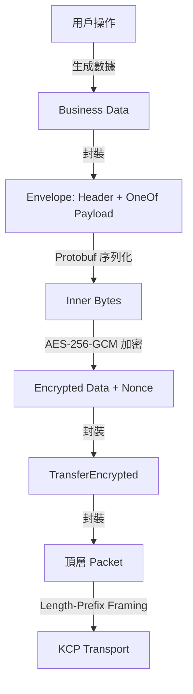
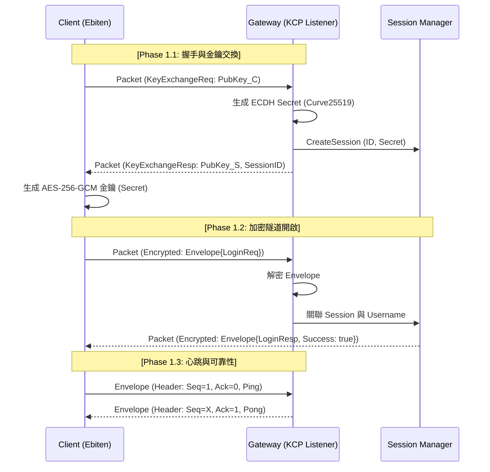
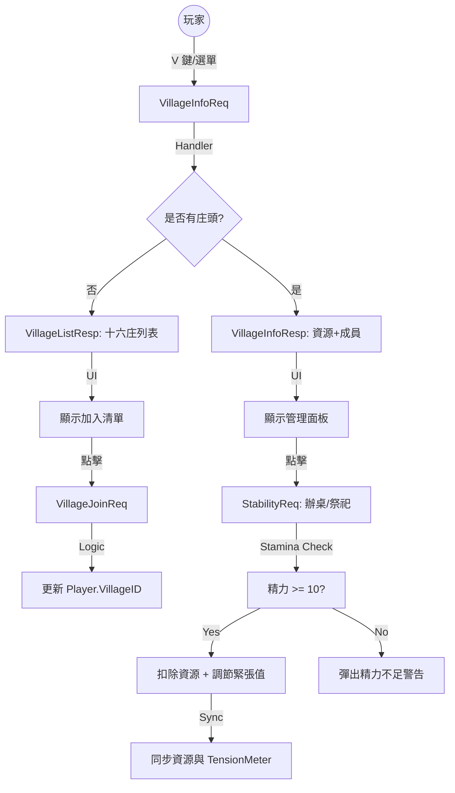
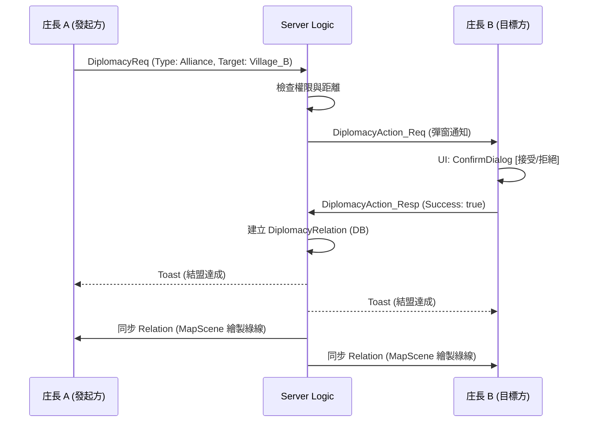
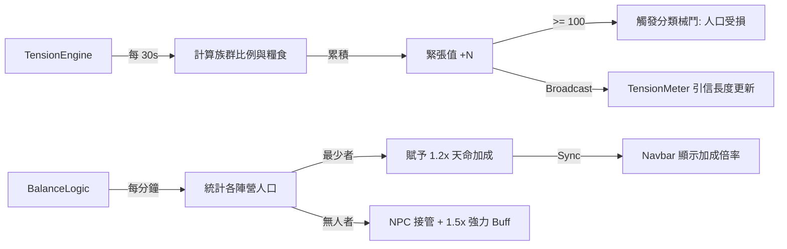

# 《台灣三國誌：萬人版》技術開發設計文件 (Domain-Driven Development Document)

> **上層文件**：[README.md](../README.md)（專案總綱）
> **平行文件**：[GDD.md](./GDD.md)（遊戲設計文件）
> **下層文件**：各 Phase 實作計劃（`docs/phases/`）

---

## 修訂紀錄

| 版本 | 日期       | 變更描述 |
| :--- | :---       | :---     |
| 1.2  | 2026-04-01 | 新增附錄 B：Phase 1 & Phase 2 完整資料流定義與領域對齊圖表。 |
| 1.1  | 2026-03-30 | 借鑑 DiceTower 成熟實作，全面更新協定架構為三層封包 (Packet→TransferEncrypted→Envelope)、ECDH+AES-GCM 加密通道、Seq/Ack 應用層可靠性、Session Resume + PendingQueue 遷移、HandleEnvelope(env, send, broadcast) Handler 模式。 |
| 1.0  | 2026-03-30 | 初版建立，定義技術棧、架構、協定與各領域規範。 |

---

## 目錄

1. [技術棧與工具鏈](#一技術棧與工具鏈)
2. [系統架構總覽](#二系統架構總覽)
3. [協定先行 (Protocol-First)](#三協定先行-protocol-first)
4. [伺服器端架構](#四伺服器端架構)
5. [客戶端架構](#五客戶端架構)
6. [網路通訊層](#六網路通訊層)
7. [資料持久化](#七資料持久化)
8. [前端 UI 框架](#八前端-ui-框架)
9. [安全性與反作弊](#九安全性與反作弊)
10. [效能與擴展性](#十效能與擴展性)
11. [開發規範與流程](#十一開發規範與流程)
12. [目錄結構](#十二目錄結構)
13. [附錄 B：資料流對齊](#附錄-bphase-1--phase-2-資料流與領域對齊)

---

## 一、技術棧與工具鏈

### 1.1 核心技術

| 層級     | 技術選型         | 版本     | 用途 |
| :---     | :---             | :---     | :--- |
| **語言** | Go               | 1.26.0   | 前後端共用 |
| **渲染** | Ebiten           | 2.x      | 2D 遊戲引擎（客戶端） |
| **網路** | xtaci/kcp-go     | latest   | 基於 UDP 的可靠傳輸 |
| **序列化** | Protocol Buffers | v3     | 訊息協定定義 |
| **建構** | Go Modules       | -        | 依賴管理 |

### 1.2 開發工具

| 工具     | 用途 |
| :---     | :--- |
| `protoc` + `protoc-gen-go` | Protobuf 編譯 |
| `gen_proto.sh`             | 一鍵生成 Go 代碼 |
| `go test`                  | 單元測試 |
| `go vet` / `staticcheck`   | 靜態分析 |
| `pprof`                    | 效能分析 |

### 1.3 第三方依賴

| 套件 | 版本 | 用途 |
| :--- | :--- | :--- |
| `xtaci/kcp-go/v5` | v5.6.24 | KCP 可靠 UDP |
| `hajimehoshi/ebiten/v2` | v2.8.x | 2D 渲染引擎 |
| `google.golang.org/protobuf` | v1.36.x | Protobuf runtime |
| `modernc.org/sqlite` | v1.44.x | 純 Go SQLite（免 CGO） |
| `go.uber.org/zap` | latest | 結構化日誌 |

---

## 二、系統架構總覽

### 2.1 高階架構

```
┌─────────────────────────────────────────────────────┐
│                  Client (Ebiten)                     │
│  ┌──────────┐ ┌──────────┐ ┌──────────┐            │
│  │  Scene   │ │    UI    │ │ Network  │            │
│  │ Manager  │ │ Manager  │ │  Client  │            │
│  └────┬─────┘ └────┬─────┘ └────┬─────┘            │
│       │            │            │                    │
│       └────────────┼────────────┘                    │
│                    │ Protobuf                        │
└────────────────────┼────────────────────────────────┘
                     │ KCP (Reliable UDP)
┌────────────────────┼────────────────────────────────┐
│                    │                                 │
│  ┌─────────────────▼───────────────────┐            │
│  │         Gateway / Router             │            │
│  │    (KCP Listener + Dispatcher)       │            │
│  └─────────────┬───────────────────────┘            │
│                │                                     │
│  ┌─────────────▼───────────────────────┐            │
│  │         Handler Layer                │            │
│  │   (Action Dispatcher + Auth)         │            │
│  └─────────┬───────────┬──────────────┘            │
│            │           │                             │
│  ┌─────────▼──┐  ┌─────▼──────────┐                │
│  │   Logic    │  │   AOI Manager  │                │
│  │  (Domain)  │  │  (5-Node Hive) │                │
│  └─────┬──────┘  └────────────────┘                │
│        │                                             │
│  ┌─────▼──────────────────────────┐                 │
│  │     Persistence Layer           │                 │
│  │  (SQLite / PostgreSQL / Redis)  │                 │
│  └─────────────────────────────────┘                 │
│                  Server                              │
└──────────────────────────────────────────────────────┘
```

### 2.2 分層職責

| 層級 | 職責 | 原則 |
| :--- | :--- | :--- |
| **Gateway** | 接受 KCP 連線、封包解碼、路由分發 | 無業務邏輯 |
| **Handler** | 驗證權限、呼叫 Logic、組裝回應 | 薄層，只做調度 |
| **Logic** | 核心業務邏輯（戰鬥、經濟、天災） | 純函數優先，可單測 |
| **AOI** | 管理玩家視野與分區同步 | 只推送變化差異 |
| **Persistence** | 資料讀寫 | 透過 Repository 介面隔離 |

---

## 三、協定先行 (Protocol-First)

### 3.1 核心原則

> **唯一事實來源 (Single Source of Truth)**：`proto/message.proto`

所有功能開發必須遵循以下流程：
```
Define Proto ──► Run gen_proto.sh ──► Implement Server Handler ──► Update Client Listen
```

### 3.2 三層封包架構



| 層級 | 訊息 | 職責 | 加密 |
| :--- | :--- | :--- | :--- |
| **Wire 層** | `Packet` | 最外層容器，區分握手/重連/加密資料 | 明文（握手）/ 密文（業務）|
| **傳輸層** | `TransferEncrypted` | 承載 AES-GCM 加密後的 Envelope | 密文 |
| **應用層** | `Envelope` | 承載 Header（Seq/Ack）+ 業務 Payload | 解密後使用 |

---

## 四、伺服器端架構

### 4.1 進入點
`server/main.go` 負責啟動 KCP Listener 並調度背景引擎（經濟、緊張度、平衡）。

### 4.2 Handler 分發模式
採用 `HandleEnvelope(env, s)` 模式，根據 OneOf 類型路由至具體處理函數。所有 Handler 均不持有連線，僅透過 Session 進行 QueueMessage 發送。

---

## 五、客戶端架構

### 5.1 場景管理器
實作 `Scene` 介面，支援 `OnEnter`, `Update`, `Draw`。

### 5.2 渲染優化
大地圖採用 Chunk 分片渲染與 3x3 視野裁切，減少不必要的 Draw Call。

---

## 六、網路通訊層

### 6.1 加密機制
*   **ECDH (X25519)**：動態交換對稱金鑰。
*   **AES-256-GCM**：全流量加密，保證前向安全性與資料完整性。

### 6.2 可靠性
*   **Seq/Ack**：應用層滑動窗口，確保封包有序且不遺漏。
*   **Session Resume**：支援熱重連，斷線後自動補發待發佇列。

---

## 七、資料持久化

### 7.1 GORM + SQLite
採用純 Go 實作的 SQLite，確保跨平台部署（Linux/macOS/Windows）無需 CGO 依賴。

### 7.2 Repository 模式
所有 DB 操作封裝在 `repo/` 目錄， Logic 層僅依賴介面。

---

## 八、前端 UI 框架

### 8.1 古風組件標準
*   **配色**：宣紙底色 (`#F5E6C8`)、墨黑文字 (`#2C1810`)。
*   **組件**：虛擬鍵盤、Toast 通知、導航欄、緊張儀、各類功能彈窗。

---

## 九、安全性與反作弊

*   **伺服器權威**：所有戰鬥計算、資源產出、位移驗證均在伺服器端完成。
*   **金鑰過濾**：通訊層強制檢查金鑰長度，過濾未授權之 Session。

---

## 十、效能與擴展性

*   **萬人同服**：透過分區 AOI 與蜂巢式網路分流目標 10,000 在線。
*   **異步處理**：資料庫寫入與廣播轉發均採用 Channel 緩衝。

---

## 十一、開發規範與流程

*   **文件優先**：所有開發必先更新 GDD/DDD。
*   **i18n**：嚴禁硬編碼文字，所有面向玩家內容均需配置於 `zh_TW.json`。

---

## 十二、目錄結構

```
ChroniclesFormosa/
├── README.md                    # 專案總綱
├── docs/
│   ├── GDD.md                   # 遊戲設計文件
│   ├── DDD.md                   # 技術開發設計文件（本文件）
│   └── phases/                  # 各 Phase 實作計劃
├── proto/                       # 協定定義
├── server/                      # 伺服器端核心代碼
├── client/                      # 客戶端核心代碼
└── common/                      # 前後端共用套件 (Crypto/Utils)
```

---

## 附錄 B：Phase 1 & Phase 2 資料流與領域對齊

> 本章節定義了從底層通訊到高層社會治理的完整數據流向，為自動化測試提供設計藍圖。

### B.1 Phase 1：安全隧道與可靠通訊流

定義了玩家從連線、握手到加密通訊的基礎鏈路。



### B.2 Phase 2：社會治理與政治博弈流

#### B.2.1 庄頭政治與維穩流 (Politics & Stability)


#### B.2.2 外交契約與同盟可視化 (Diplomacy)


#### B.2.3 社會張力與天命平衡 (Tension & Balance)


---

*本文件為《台灣三國誌》技術開發之最高技術指引，與 [GDD.md](./GDD.md) 遊戲設計文件互為姊妹文件。*
