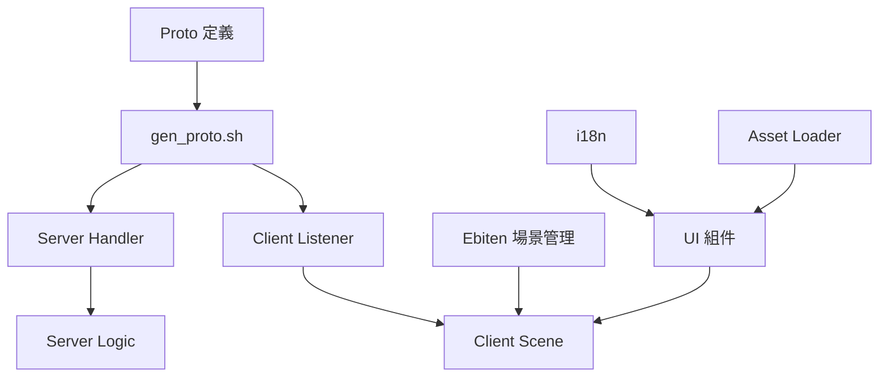

# Phase 1 實作計劃：基礎架構 (Core Infrastructure)

> **上層文件**：[DDD.md](../DDD.md)、[GDD.md](../GDD.md)
> **工作清單**：[phase1_task.md](./phase1_task.md)

---

## 修訂紀錄

| 版本 | 日期       | 變更描述 |
| :--- | :---       | :---     |
| 1.1  | 2026-03-31 | 完成實作：三層封包加密架構、大地圖渲染優化、全域 UI 與多語系框架、整合測試。 |
| 1.0  | 2026-03-30 | 初版建立。 |

---

## 一、目標

建立整個遊戲的技術骨架，讓後續所有功能模組（庄頭、天災、戰鬥）能在此基礎上開發。

Phase 1 完成後，已達成：
1. ✅ 客戶端與伺服器透過 KCP 建立加密隧道（ECDH + AES-256-GCM）並交換 Protobuf 訊息
2. ✅ 實作三層封包架構（Packet → TransferEncrypted → Envelope），具備 Seq/Ack 可靠性與 Session Resume 斷線重連機制
3. ✅ 客戶端 Ebiten 大地圖實作 5x5 Chunk 分區管理與 3x3 視野中心優化渲染，支援離屏緩衝
4. ✅ 基礎的 `Village` 領域模型與 `EconomyEngine` 資源產出邏輯運行正常
5. ✅ 前端 UI 核心組件（Navbar、Toast、Theme、Keyboard、Form）完整實作，支援多語系高品質字體渲染

---

## 二、範圍與邊界

### 包含
- Protobuf 協定定義（三層封包、認證、註冊、庄頭基礎、AOI 移動）
- KCP 伺服器啟動與客戶端加密握手
- Handler Dispatcher 機制（HandleEnvelope 三函數模式）
- 完整登入與註冊流程（包含 SQLite 資料持久化）
- Ebiten 場景管理器 + 大地圖 Chunk 渲染（Camera 平移與縮放）
- UI 核心組件（支援 Backspace 連續刪除、滑鼠點擊判定）
- i18n 多語系架構（支援 繁中/簡中/英文/日文）
- 資源遷移與統一載入機制（go:embed）

### 不包含
- 戰鬥計算邏輯（Phase 2+）
- 天災系統（Phase 3）
- 聊天與情報感測（Phase 2）
- 海上貿易（Phase 2+）
- 族群緊張儀完整邏輯（Phase 2）

---

## 三、技術方案

### 3.1 Protobuf 協定 (`proto/message.proto`)

**核心架構**：
採用三層封裝模式，確保傳輸安全與應用層可靠性：
1. **Wire 層**：`Packet` 處理握手與加密載體。
2. **傳輸層**：`TransferEncrypted` 承載 AES-GCM 加密後的數據。
3. **應用層**：`Envelope` 包含 Seq/Ack 標頭與領域業務載荷 (OneOf)。

### 3.2 伺服器核心

#### 儲存與邏輯
- **Database**：使用 Pure-Go SQLite (`modernc.org/sqlite`) 搭配 GORM。
- **Session**：實作 `SessionManager` (Actor 模型)，支援 `SessionID` 識別與歷史訊息補發。
- **AOI**：初步實作蜂巢式分區節點，支援跨區遷移與位置廣播。

### 3.3 客戶端核心

#### 渲染與相機
- **Camera**：支援世界座標與螢幕座標轉換，提供右鍵拖拽與滾輪縮放。
- **大地圖 Chunk 系統**：
    - 全島地圖 100x100 Tile，切分為 5x5 = 25 個 Chunk。
    - 繪製時僅渲染視野內 3x3 個 Chunk。
    - 使用 `ebiten.Image` 進行離屏緩衝，僅在資料變更或格線切換時重繪。

### 3.4 UI 核心組件

| 組件 | 功能實作 |
| :--- | :--- |
| `GlobalNavbar` | 使用 `text.Draw` 渲染，顯示 RTT、連線狀態與場景標題。 |
| `GlobalToastManager` | 支援四種等級通知，自動淡出與排隊。 |
| `GlobalThemeManager` | 管理宣紙風格色盤與陣營專屬色。 |
| `GenericForm` | 支援 Tab/滑鼠 切換焦點、Backspace 長按連續刪除、密碼遮罩。 |
| `GuiKeyboard` | 實作全域虛擬鍵盤，對接實體輸入與回調。 |

### 3.5 i18n 與字體

- **字體渲染**：遷移 `unifont-16`，解決 `ebitenutil` 不支援中文的問題。
- **多語系**：支援 `zh_TW`, `zh_CN`, `en_US`, `ja_JP`。
- **Fallback**：未定義之鍵值將回退至英文語系。

---

## 四、依賴關係

---

## 五、風險與對策 (已克服)

| 風險 | 現況 | 解決方案 |
| :--- | :--- | :--- |
| 文字顯示消失 | 已解決 | 引入 TTF/OTF 字體渲染取代 DebugPrint。 |
| 座標判定偏移 | 已解決 | 繪製與判定改為動態獲取 Window 尺寸。 |
| 輸入體驗不佳 | 已解決 | 實作 KeyPressDuration 計時器達成連續刪除。 |
| 封包安全性 | 已解決 | 實作 ECDH 密鑰交換，全流量 AES-GCM 加密。 |

---

## 六、驗收標準

1. [x] `go build ./server` 編譯無誤
2. [x] `go build ./client` 編譯無誤
3. [x] 客戶端啟動後可透過 F1 註冊並連線登入
4. [x] 大地圖場景可流暢滾動，3x3 Chunk 動態載入正常
5. [x] Navbar 正確顯示 RTT 與連線狀態
6. [x] Toast 正常彈出通知 (Success/Error)
7. [x] i18n 文字顯示清晰，無亂碼或隱形問題
8. [x] Logic 層與 Handler 層單元測試全數通過
9. [x] 整合測試 (Handshake -> Auth -> Join -> AOI) 跑通

---

*Phase 1 已完工。接下來進入 [Phase 2](./phase2_plan.md)（社會與族群系統）。*
