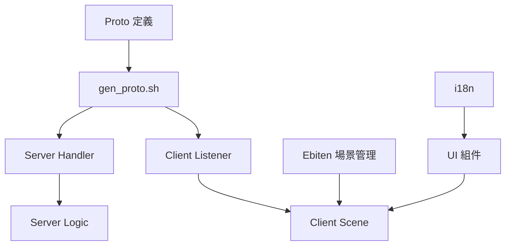

# Phase 1 實作計劃：基礎架構 (Core Infrastructure)

> **上層文件**：[DDD.md](../DDD.md)、[GDD.md](../GDD.md)
> **工作清單**：[phase1_task.md](./phase1_task.md)

---

## 修訂紀錄

| 版本 | 日期       | 變更描述 |
| :--- | :---       | :---     |
| 1.0  | 2026-03-30 | 初版建立。 |

---

## 一、目標

建立整個遊戲的技術骨架，讓後續所有功能模組（庄頭、天災、戰鬥）能在此基礎上開發。

Phase 1 完成後，應能達成：
1. ✅ 客戶端與伺服器透過 KCP 建立連線並交換 Protobuf 訊息
2. ✅ 基礎的 `Envelope` + `Action` 訊息路由機制運作
3. ✅ 客戶端 Ebiten 大地圖能分區載入並流暢渲染
4. ✅ 基礎的 `Village` 領域模型與 Proto 定義完成
5. ✅ 前端 UI 核心組件（Navbar、Toast、Theme）可用

---

## 二、範圍與邊界

### 包含
- Protobuf 協定基礎定義（Envelope、認證、庄頭基礎）
- KCP 伺服器啟動與客戶端連線
- Handler Dispatcher 機制
- 基礎登入流程（帳號 + 密碼，無 OAuth）
- Ebiten 場景管理器 + 大地圖 Chunk 渲染
- UI 核心組件初版
- i18n 基礎架構
- 專案目錄結構建立

### 不包含
- 戰鬥計算邏輯（Phase 2+）
- 天災系統（Phase 3）
- 聊天與情報感測（Phase 2）
- 海上貿易（Phase 2+）
- 族群緊張儀完整邏輯（Phase 2）

---

## 三、技術方案

### 3.1 Protobuf 協定 (`proto/message.proto`)

**首批定義的訊息**：

```protobuf
// Envelope + Action 枚舉（見 DDD.md §3.3）
// LoginReq / LoginResp
// VillageInfo / VillageJoinReq / VillageJoinResp
// AOI 基礎 MapSync
```

**gen_proto.sh 腳本**：
```bash
#!/bin/bash
protoc --go_out=. --go_opt=paths=source_relative \
  proto/message.proto
```

### 3.2 伺服器核心

#### 啟動流程
```
main.go
  ├── 載入 config（--port, --db flags）
  ├── 初始化 Repository（SQLite 或 PostgreSQL）
  ├── 初始化 AOI Manager
  ├── 啟動 KCP Listener
  └── Accept Loop → SpawnSession → ReadLoop → Dispatch
```

#### Session 生命週期
- `Accept` → 建立 `Session` 物件
- `ReadLoop` → 持續接收 Envelope → 呼叫 `Dispatch`
- 心跳 30 秒超時 → 斷線
- 重連 token（5 分鐘有效）

### 3.3 客戶端核心

#### Ebiten Game Loop 整合
```go
type Game struct {
    sceneManager *SceneManager
    networkClient *NetworkClient
    uiManager    *UIManager
}

func (g *Game) Update() error {
    g.networkClient.ProcessIncoming()
    return g.sceneManager.Current().Update()
}

func (g *Game) Draw(screen *ebiten.Image) {
    g.sceneManager.Current().Draw(screen)
    g.uiManager.DrawGlobals(screen)  // Navbar, Toast
}
```

#### 大地圖 Chunk 系統
- 全島 5×5 = 25 個 Chunk
- 每 Chunk 包含 N×N 個 Tile
- 視野中心 3×3 = 9 Chunk 同時載入
- Tile 含：地形類型、瘴氣等級、所屬庄頭 ID、資源類型

### 3.4 UI 核心組件初版

| 組件 | Phase 1 功能 |
| :--- | :--- |
| `GlobalNavbar` | 顯示連線狀態（延遲 ms）、當前場景名稱 |
| `GlobalToastManager` | 成功/錯誤/警告三種等級通知 |
| `GlobalThemeManager` | 日/夜模式切換、配色管理 |
| `GuiKeyboard` | 登入場景文字輸入 |
| `DrawFilledRoundedRect` | 所有面板底板繪製 |

### 3.5 i18n 基礎

初版支援繁體中文（`zh_TW.json`），包含：
- 登入介面文字
- 系統訊息（連線成功/失敗）
- 地圖場景基礎 tooltip

---

## 四、依賴關係



---

## 五、風險與對策

| 風險 | 影響 | 對策 |
| :--- | :--- | :--- |
| KCP 版本不穩 | 連線品質差 | 備選 WebSocket fallback |
| Ebiten 大地圖效能 | 卡頓 | Chunk 預載 + 離屏緩衝 |
| Protobuf 向下相容 | 更新時舊客戶端崩潰 | 嚴格遵守只增不刪規則 |

---

## 六、驗收標準

1. [ ] `go build ./server` 和 `go build ./client` 均無錯誤
2. [ ] 客戶端啟動後可連線至伺服器並完成登入握手
3. [ ] 大地圖場景可流暢滾動，視野邊緣 Chunk 自動載入
4. [ ] Navbar 正確顯示連線延遲
5. [ ] Toast 可顯示成功/錯誤訊息
6. [ ] i18n 切換語系時所有 UI 文字正確更新
7. [ ] 單元測試覆蓋率 > 60%（Logic 層）

---

*Phase 1 完成後，進入 [Phase 2](./phase2_plan.md)（社會與族群系統）。*
